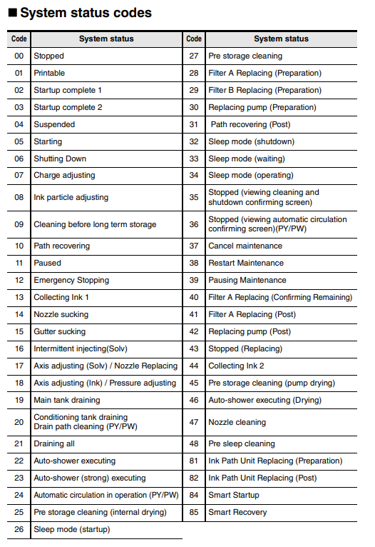
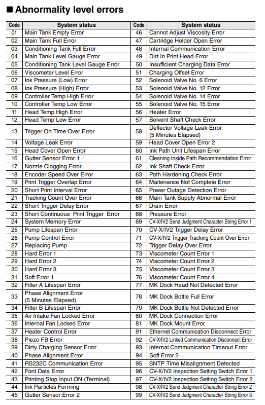
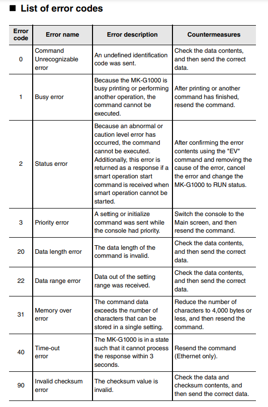

# Keyence Inkjet Printer Serial Com Wrapper

## System Status Codes

## System Error Codes

### Abnormality level errors
These are errors that indicate that the MK-G1000 has a printing disabled status, such as the nozzle being clogged.
These errors cause the controller's CAUTION LED (orange) to turn ON.
Handle the cause of the error appropriately, and then reset the error.

### Caution level errors
These are errors that indicate that the MK-G1000 has a printing enabled status but in which maintenance is required, such as the ink or solvent cartridge being empty

## Response Error Codes

